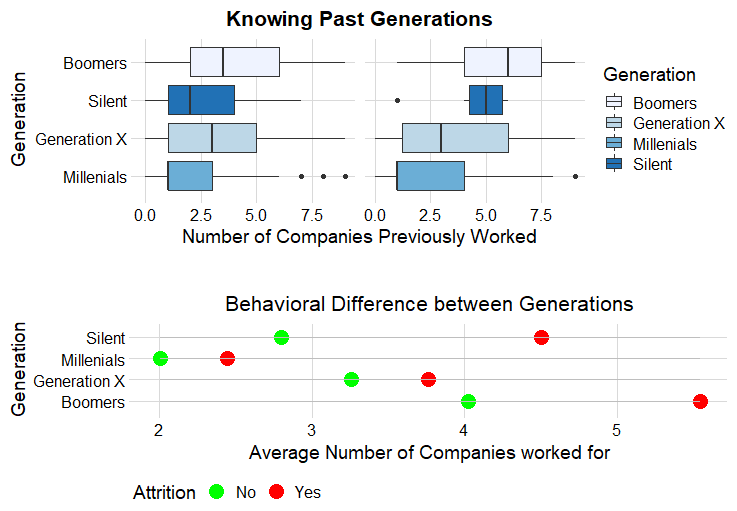
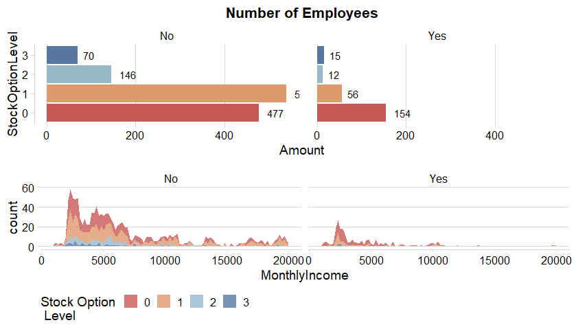

# Employee Attritions

## **Introduction :**
### **What is Attrition and what determines it?**  
Attrition: It is basically the turnover rate of employees inside an organization.

This can happen for many reasons:  
1. Employees looking for better opportunities.
2. A negative working environment.
3. Bad management.
4. Excessive working hours.

### **Structure of the Project:**  
This project will be structured in the following way:  
- **Questions:** Questions will be asked previous to the visualization to make sure the visualizations shown in this project are insightful.
- **Summary:** After each section I will provide a summary to understand what we got from the visualizations.
- **Recommendations:** What recommendations could be given to the organization to reduce the attrition rate.

## **Table of Contents :**  

**I. Summary of our Data:**  

**II. Gender Analysis:**  
- Age Distribution by Gender  
- Job Satisfaction Distribution by Gender  
- Monthly Income by Gender  

**III. Analysis by Generation and Education:**  
- Understanding Attrition by Generation  
- Attrition by Educational Level  

**IV. The Impact of Income towards Attrition:**  
- Average income by Department  
- Satisfaction by Income  
- Income and the Levels of Attrition  
- Average Daily Rates and Percent Difference  
- Attrition by Overtime  

**V. Working Environment:**  
- Mean Salary by Job Role  
- Attrition by Job Role  
- Current Managers and Average Satisfaction Score  
- Average Environment Satisfaction  
- Distance from Work Status  
- Employees have Stockoption levels  
- Attrition due to Business Travels  

**VI. Analysis and Models**  
- Correlation Matrix  
- Bi-Variate Analysis  
- Decision Trees  
- Feature Importance  
- Confusion Matrix  

**VIII. Conclusion:**  
- Top Reasons why Employees Leave the Organization  

 
 

## **Summary of our Data:**
 
- **Dataset Structure:** 1470 observations (rows), 35 features (variables)
Missing Data: Luckily for us, there is no missing data! this will make it easier to work with the dataset.  
- **Data Type:** We only have two datatypes in this dataset: factors and integers
Label" Attrition is the label in our dataset and we would like to find out why employees are leaving the organization!  
- **Imbalanced dataset:** 1237 (84% of cases) employees did not leave the organization while 237 (16% of cases) did leave the organization making our dataset to be considered imbalanced since more people stay in the organization than they actually leave.  

  

 
### **Distribution of our Labels :**  
This is an important aspect that we are dealing with an imbalanced dataset will help us determine what will be the best approach to implement our predictive model. 84% of employees did not quit the organization while 16% did leave the organization.
 

## **Gender Analysis :**  
In this section, we will try to see if there are any discrepancies between male and females in the organization. Also, we will look at other basic information such as the age, level of job satisfaction and average salary by gender.

### **Distribution of the Age of our employees :**  
The average age of females is 37.33 and for males is 36.65 and both distributions are similar.
 

 

### **Distribution of Job Satisfaction :**  
For individuals who didn't leave the organization, job satisfaction levels are practically the same. However, for people who left the organization , females had a lower satisfaction level as opposed to males.
 

 

### **Monthly Income by Gender :**
The average salaries for both genders are the same with males having an average of 6380.51 and females 6686.57.

 

 

 

## **Generation and Education :**
Each type of generation have their particular peculiarities and that is why we should explore in this dataset.

### **Generational Behavior :**  
- Most millenials are still relatively young, so that explains why the number of companies for millenials is relatively low however.  
- It seems that millenials are the ones with the highest turnover rate, followed by the boomers. 
- The newer generation which are the millenials opt to look more easy for other jobs that satisfy the needs on the other side we have the boomers which are approximating retirement and could be one of the reasons why the turnover rate of boomers is the second highest.
 

 

### **Attrition by Educational Level :**  
The bachelors are the ones showing the highest level of attrition which makes sense since Millenials create the highest turnover rate inside the organization.
 

 

## **Impact of Income towards Attrition :**  

### **Average Income by Department:**
There is a huge differences in each department by attrition.
 

 

### **Satisfaction by Income :**
The lower the job satisfaction the wider the gap by attrition status in the levels of income. 

 

### **Income and the Level of Attrition:**  
This might indicate that at least for the these roles, the sample population that left the organization was mainly because of income.
 

 

### **Average and Percent Difference of Daily Rates :**
**HealthCare Representatives** , **Sales Representatives** , and **Research Scientists** have the highest daily rates differences in terms of employees who quit or didn't quit the organization.
 

 

### **Attrition due to Overtime :**
Over 54% of workers who left the organization worked overtime!!!

 

 

## **Working Environment :**
In this section, we will explore everything that is related to the working environment and the structure of the organization.  

### **Mean Salary by JobRole :**
**Managers** and **Research Directors** have the highest salary on average.
 

 

### **Attrition by Job Role :**
Sales Representatives, HealthCare Representatives and Managers have the highest attrition rates. This could give us a hint that in these departments we are experiencing certain issues with employees. 

 

### **Current Managers and Average Satisfaction Score:**
Employees that are dealing with recently hired managers have a lower satisfaction score than managers that have been there for a longer time.  

 

### **Average Environment Satisfaction:**
managers and healthcare representatives are dealing with a lower working environment however, we don't see the same with sales representatives that could be because most sales representatives work outside the organization.  

 

 

### **Distance from Work Status :**

 

### **Employees have Stockoption levels :**

 

### **Attrition due to Business Travels :**

 

## **Correlation Matrix :**
In this section we will understand what features have a positive correlation with each other. This tells us whether there is an association between two variables. 

 

## **Bi-Variate Analysis :**

 

 

## **Decision Trees :**

## **Feature Importance :**

## **Confusion Matrix :**

## **Conclusion :**
Top Reasons why Employees leave the Organization:
- **Monthly Income:** Income is a huge factor as why employees leave the organization in search for a better salary.
- **No Overtime:** This was a surpirse, employees who don't have overtime are most likely to leave the organization. This could be that employees would like to have a higher amount of income or employees could feel that they are underused.
- **Age:** This could also be expected, since people who are aiming to retire will leave the organization. 
Knowing the most likely reasons why employees leave the organization, can help the organization take action and reduce the level of Attrition inside the organization.